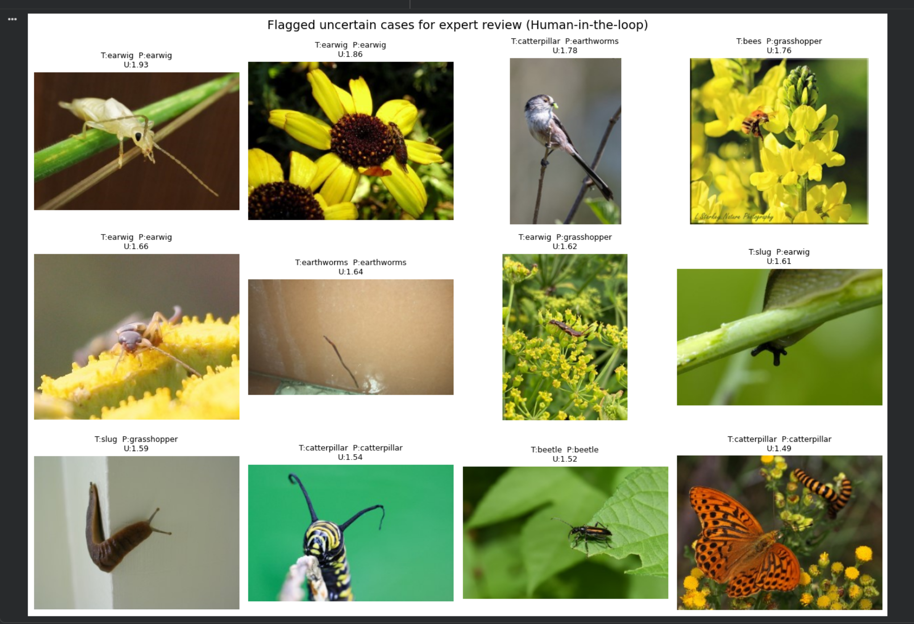
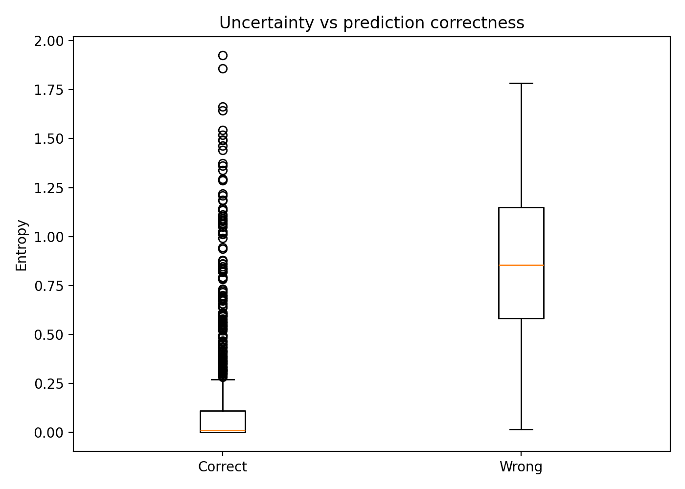
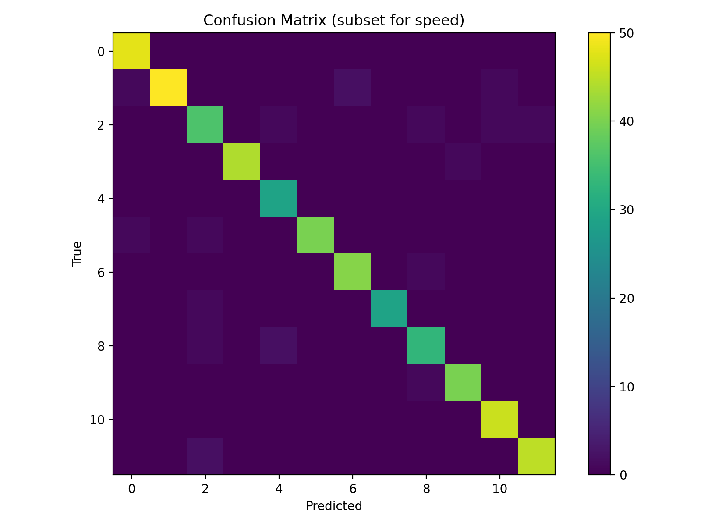
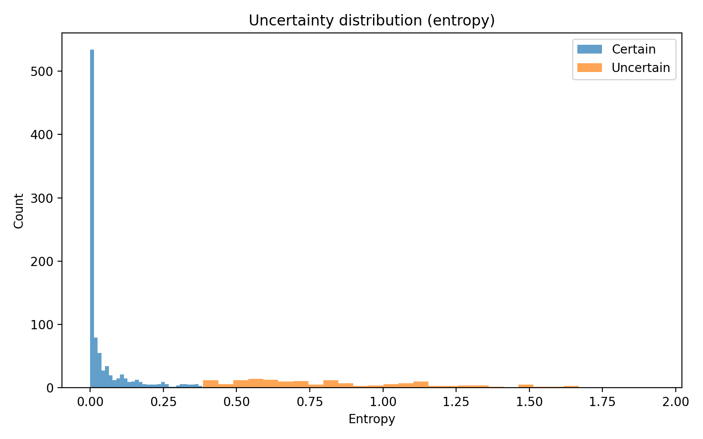

# Uncertainty-Aware Agricultural Pest Identification (Human-in-the-Loop Prototype)

This project demonstrates a computer vision pipeline for automated agricultural pest identification using transfer learning (EfficientNet) and uncertainty-aware flagging for expert verification. The aim is to replicate a practical "human-in-the-loop" workflow where high-confidence predictions are accepted automatically and ambiguous cases are routed for manual review.

## Dataset
Kaggle: Agricultural Pests Image Dataset (`vencerlanz09/agricultural-pests-image-dataset`)
## How to Run

1. Download the Kaggle dataset:
   `vencerlanz09/agricultural-pests-image-dataset`
2. Open the notebook in Google Colab.
3. Train EfficientNet-B0.
4. Run the uncertainty-flagging step to export:
   - `uncertain_predictions.csv`
   - `certain_predictions.csv`
   - `flagged_uncertain/`

Key Features:
Uncertainty-Aware Triage: Instead of a simple "black box" classifier, this system uses prediction entropy to measure model confidence.

Human-in-the-Loop (HITL) Workflow: Automatically identifies "hard" cases (low confidence) that require expert verification, simulating a real-world industrial pipeline.

Transfer Learning with EfficientNet: Leverages pre-trained weights to achieve high accuracy on specialized agricultural pest datasets.

Performance Metrics: Demonstrates a clear accuracy gap between "Certain" (99%+) and "Uncertain" (~73%) predictions, proving the reliability of the flagging mechanism.

## Visual Outputs

### Flagged uncertain cases (human-in-the-loop)

### Uncertainty vs correctness

### Confusion Matrix

### Uncertainty Distribution

## Methods
- Model: EfficientNet-B0 (PyTorch + timm)
- Train/validation split: 80/20
- Uncertainty metric: prediction entropy  
  H(p) = - Σ pᵢ log(pᵢ)
- Workflow: top 15% most uncertain predictions are flagged for human verification

## Key Results (Validation)

- **Certain bucket (auto-accepted):** 934 images, **99.14% accuracy**
- **Uncertain bucket (flagged for expert review):** 165 images, **73.33% accuracy**

This demonstrates uncertainty-based triage: high-confidence predictions are highly reliable, while ambiguous/noisy cases are routed for manual verification.

- Certain bucket (auto-accepted): **934 images**, **99.14% accuracy**
- Uncertain bucket (flagged): **165 images**, **73.33% accuracy**

## Outputs
- `outputs/best_model.pt`
- `outputs/confusion_matrix.png`
- `outputs/uncertain_predictions.csv`
- `outputs/certain_predictions.csv`
- `outputs/flagged_uncertain/`

## Relevance

This prototype directly supports human-in-the-loop pest monitoring systems by automatically accepting high-confidence predictions and flagging ambiguous specimens for expert verification, reducing manual workload while maintaining high reliability.

## Limitations & Next Steps
- Dataset contains noisy/non-target images; uncertainty helps with quality control.
- Future work: multi-angle imaging / focus stacking (multi-modal inputs).
- Explore stronger uncertainty methods (MC Dropout, deep ensembles).
- Extend to detection (YOLO) for trap images and multi-insect scenes.

## Tools
Python, PyTorch, torchvision, timm, scikit-learn, Google Colab
